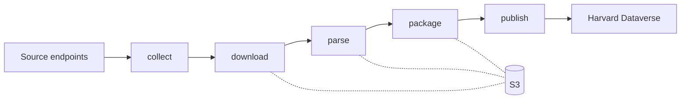

# backstage

backstage is the data collection and processing pipeline for the [openstage project](https://github.com/openstage-eu). It collects legislative procedure data from official sources, processes it into structured formats, and publishes research-ready datasets.

## What backstage does

backstage handles the operational side of data collection: querying official endpoints, downloading raw data, parsing it into typed [openstage](https://github.com/openstage-eu/openstage) models, and publishing packaged datasets to [Harvard Dataverse](https://dataverse.harvard.edu/).

Each step runs independently and communicates through S3 rather than in-memory data passing. Any step can be re-run without repeating earlier steps.

## Supported cases

backstage organizes data collection by **case**, where each case represents a jurisdiction or data domain with its own collection logic, source endpoints, and processing pipeline.

| Case | Description | Status |
|------|-------------|--------|
| [EU](cases/eu/data-universe.md) | European Union interinstitutional legislative procedures | In development |

## Related projects

| Project | Role |
|---------|------|
| [openstage](https://github.com/openstage-eu/openstage) | Data models, adapters, and codebooks |
| [openbasement](https://github.com/openstage-eu/openbasement) | Template-based RDF extraction from EU Cellar data |
| backstage (this project) | Data collection, processing, and publishing |
